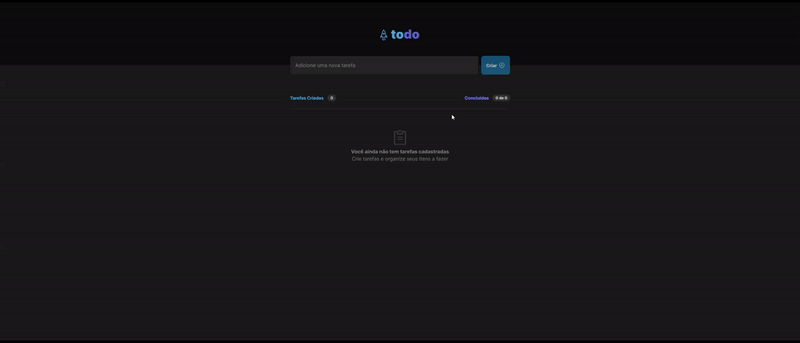

<h1 align="center">
  Todo 
</h1>

<p align="center">
A aplicação Todo é uma ferramenta simples e intuitiva para gerenciar suas tarefas diárias. Com recursos de adição, marcação de conclusão e exclusão de tarefas, você pode organizar suas responsabilidades de forma eficiente.
</p>

<p align="center">
  <a href="#como-executar">ℹ️ Como Executar?</a>&nbsp;&nbsp;&nbsp;|&nbsp;&nbsp;&nbsp;
  <a href="#web">💻 Web</a>&nbsp;&nbsp;&nbsp;|&nbsp;&nbsp;&nbsp;
  <a href="#tecnologias">🚀 Tecnologias</a>&nbsp;&nbsp;&nbsp;
</p>

---

# Como Executar?

> Clone o Repositório:

Node version 18.16.0

Clone

```bash
git clone https://github.com/JonatanPaes/todo-list.git
```

Para executar o projeto

```bash
cd todo-list
```

Instale as dependências do projeto

```bash
yarn install
```

# Web
Para executar o projeto

```sh
yarn start
```

<p align="center">
  
</p>

# Tecnologias
- [ReactJS](https://react.dev/)
- [TypeScript](https://github.com/microsoft/TypeScript)
- [Phosphor Icons](https://phosphoricons.com/)
- [uuid](https://github.com/uuidjs/uuid)
- [Vite](https://vitejs.dev/)